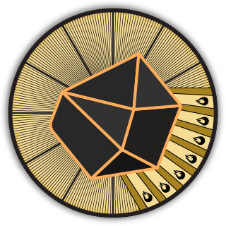

<h1 align="center">  Repositorio de la cátedra de Teoría de Circuitos II  </h1>

Esta organización de github pertenece a la cátedra de Teoría de Circuitos II del Instituto Tecnológico de Buenos Aires.

## Repositorios principales

    
    
    
    
    
    

